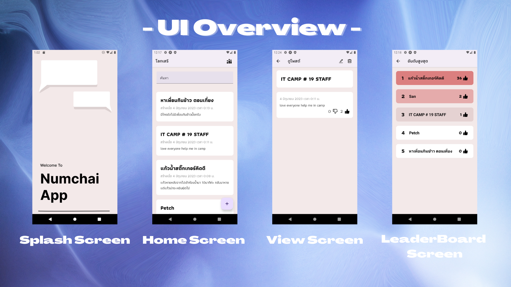
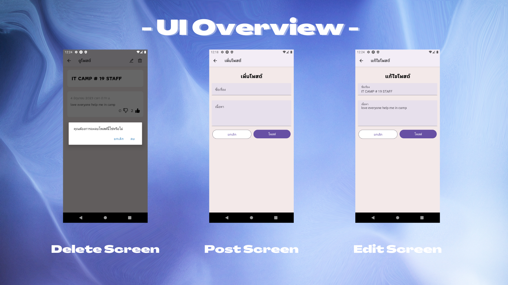

# NumChaiApp


This is the repository of NumChaiApp, a cool social media mobile application, designed for free-speech. Made with in the ITCAMP19 MobilAnt Camp.

> ✨ View the full presentation [here](https://github.com/lemasc/NumChaiApp/blob/master/presentation/presentation.pdf).





## Technologies
- React Native (Expo)
- TypeScript
- React Native Paper (UI Library)
- Pocketbase (as a backend)
- SWR (for global data fetching)

## Development

### Environment Setup

To run this project locally, you should install Node.js and Yarn.

Install all dependencies by running the following command.

```
yarn
```

### Backend setup

Before starting the application, you should run the Pocketbase server as a backend. This repo includes a built-in executable for Windows, so you can start the server by using the following command.

```
yarn db:serve
```

The terminal will print out the URL endpoint, similar to this. The server will be running as long as the terminal is open. **Without the Pocketbase server running, this app will not work.**

```
Server started at http://0.0.0.0:8090
 ➜ REST API: http://0.0.0.0:8090/api/
 ➜ Admin UI: http://0.0.0.0:8090/_/
```

> I decided to serve on the IP address 0.0.0.0 as it can be access from the network.

For the first run, visit the Admin UI (locally will be `http://127.0.0.1:8090/_/`) and follow the instructions to set up Pocketbase. Then, the database should be ready without any further configuration.

However, if you prefer not to use the built-in Pocketbase server, you can import the `pb_schema.json` file into any Pocketbase server. 

By default, it expects the Pocketbase server to be the same IP address as the Metro server. If needed, change the server endpoint defined in the `plugins/pocketbase.ts` file.

### Running the project

In the terminal, run the following command to start the Metro bundler.

```
yarn start
```

You can now run the application! See [Expo docs](https://docs.expo.dev/workflow/run-on-device/) on how to run via the Expo Go app. You can also run it on your computer by using the Android emulator, but that requires further installation, see the [guide](https://docs.expo.dev/workflow/android-studio-emulator/).

# License

MIT
